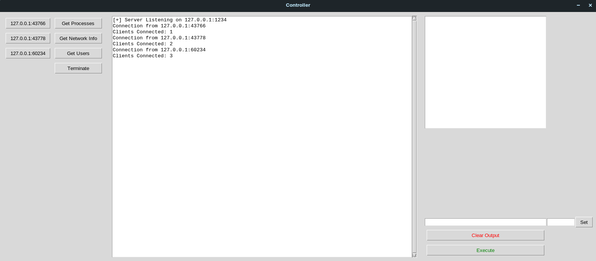
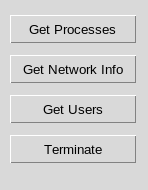
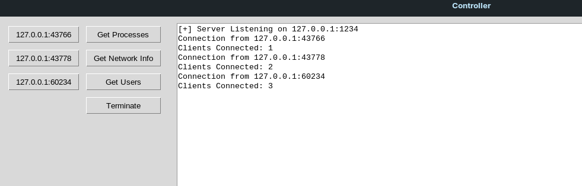
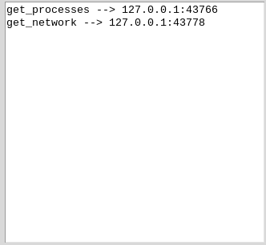
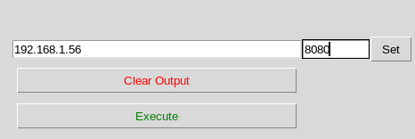

# Command and Control

This program allows a user to issue commands via  a GUI to a client application.

## Installation

The modules tkinter, pwd and netifaces are required to run this program. 
Tkinter and pwd should be preinstalled in Pythons built-in modules on Linux.

Note: The pwd module is Linux only.

https://pypi.org/project/netifaces/

https://docs.python.org/3/library/tkinter.html

https://docs.python.org/3/library/pwd.html

## Tkinter Installation

### Windows:
    pip install tk

### Linux:
    (Debian) sudo apt install python-tk
    (Arch) sudo pacman -S tk

## Netifaces Installation

## Windows:
    pip install netifaces

## Linux:
    pip3 install netifaces

## Client Usage
Connect to the default controller address localhost:1234:

    python3 client.py

Connect to custom controller address:

    python3 client.py -a 192.168.1.27 -p 8080

## Controller Usage

The buttons on the left side of the applications 
are commands that can be issued to clients:

    Get Processes
    Get Network Info
    Get Users
    Terminate

Get Processes returns a list of running processes.

Get Network Info returns network information such as local IP and default gateway.

Get Users returns user information (Linux only).

Terminate will close the clients application.

When users connect, buttons will appear to the left of these with the clients addresses, aswell as in the output area in the center of the screen. 

To send a command, click the client button then the command(s) you want to send, then click execute in the bottom right hand corner. 

If you want to send a command to multiple clients, click the the command and then all the clients you want to send to. (The order is irrelevant).

If you want to send a different command to each connected client, click the command followed by the client you want to send it to.

The commands that will be sent to each client will appear on the right.

The address of the controller can be changed by entering the IP followed by the port number in the respective input boxes, then clicking set.

